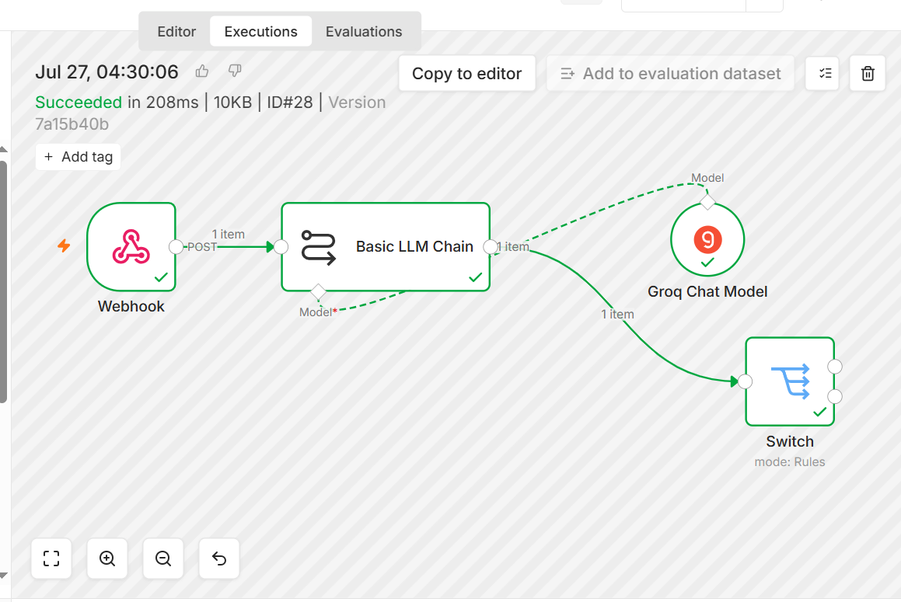
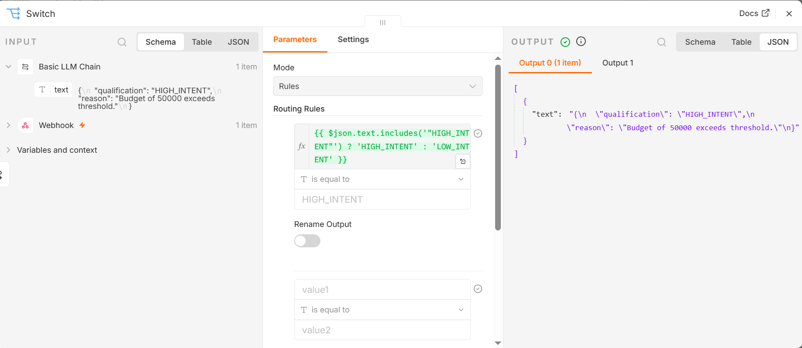

# ⚡ Real-Time AI Lead Qualification & Routing Engine

An automated, ultra-low-latency CRM lead qualification pipeline built with **GoHighLevel (GHL)**, **n8n**, and **Groq (Llama-3 / open-source LLMs)**.

This pipeline ingests inbound CRM contact data, performs intelligent intent evaluation via open-source LLM inference, and dynamically routes leads down tailored follow-up branches in **~220ms**.

---

## 📐 System Architecture

### **Workflow Breakdown:**
1. **Trigger (GoHighLevel Webhook):** Inbound contact custom field data (e.g., budget, requirements) triggers an automated HTTP POST payload.
2. **Orchestration (n8n Engine):** Ingests the JSON payload and structures context for model inference.
3. **AI Inference (Groq Chat Model):** Evaluates lead parameters against explicit criteria, generating structured JSON intent classification (`HIGH_INTENT` vs. `LOW_INTENT`).
4. **Logic & Routing (Switch Node):** A fail-safe regex parser evaluates classification results and routes leads dynamically to high-value or nurture pipelines.

---

## ⚡ Performance Metrics

* **Average Execution Speed:** `~220ms` end-to-end processing time.
* **Accuracy & Resilience:** Includes prompt constraints and JavaScript fallback logic to ensure strict JSON structure validation under all edge cases.

---

## 🎯 Routing & Execution Breakdown

* **Output 0 (`HIGH_INTENT`):** Budget meets or exceeds evaluation threshold → Triggers immediate high-priority sales alerts or direct booking workflows.
* **Output 1 (`LOW_INTENT` / Default):** Missing budget or low intent threshold → Routes lead to automated nurture sequences.

---

## 🚀 Setup & Installation

### Prerequisites
* **n8n Instance** (Cloud or Self-Hosted)
* **GoHighLevel Account** with access to Workflows and Webhooks
* **Groq API Key** ([console.groq.com](https://console.groq.com/))

### Installation Steps

1. **Import Workflow into n8n:**
   * Open your n8n workspace.
   * Click **Workflows** ➔ **Import from File**.
   * Select your exported `.json` workflow file.

2. **Configure Credentials:**
   * In n8n, add your **Groq API Key** credentials under the **Groq Chat Model** node.
   * Copy your production **Webhook URL** from the n8n Webhook node.

3. **Configure GoHighLevel:**
   * Create a Workflow in GHL triggered on *Contact Created* or *Tag Added*.
   * Add a **Webhook** action pointing to your n8n production Webhook URL.
   * Include custom data parameters (e.g., `budget` mapped to `{{contact.budget}}`).

4. **Publish & Test:**
   * Toggle n8n workflow state to **Published**.
   * Run a test contact through GHL to verify sub-300ms execution.

---

## 🛡️ License

Distributed under the MIT License.
